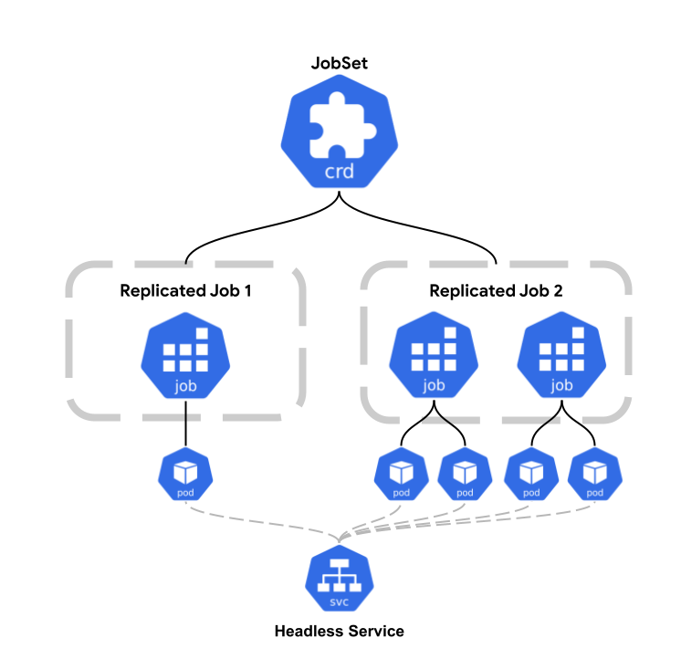

# JobSet

[](https://github.com/kubernetes-sigs/jobset/releases/latest)

JobSet is a Kubernetes-native API for managing a group of [k8s Jobs](https://kubernetes.io/docs/concepts/workloads/controllers/job/) as a unit. It aims to offer a unified API for deploying HPC (e.g., MPI) and AI/ML training workloads (PyTorch, Jax, Tensorflow etc.) on Kubernetes.

Take a look at the [concepts](/docs/concepts/README.md) page for a brief description of how to use JobSet.

## Conceptual Diagram


## Installation

**Requires Kubernetes 1.26 or newer**.

To install the latest release of JobSet in your cluster, run the following command:

```shell
kubectl apply --server-side -f https://github.com/kubernetes-sigs/jobset/releases/download/v0.4.0/manifests.yaml
```

The controller runs in the `jobset-system` namespace.

Read the [installation guide](/docs/setup/install.md) to learn more.

## Production Readiness status

- ✔️ API version: v1alpha2, respecting [Kubernetes Deprecation Policy](https://kubernetes.io/docs/reference/using-api/deprecation-policy/)
- ✔️ Up-to-date [documentation](https://jobset.sigs.k8s.io/docs).
- ✔️ Test Coverage:
  - ✔️ Unit Test [testgrid](https://testgrid.k8s.io/sig-apps#pull-jobset-test-unit-main).
  - ✔️ Integration Test [testgrid](https://testgrid.k8s.io/sig-apps#pull-jobset-test-integration-main)
  - ✔️ E2E Tests for Kubernetes
    [1.26](https://testgrid.k8s.io/sig-apps#pull-jobset-test-e2e-main-1-26),
    [1.27](https://testgrid.k8s.io/sig-apps#pull-jobset-test-e2e-main-1-27),
    [1.28](https://testgrid.k8s.io/sig-apps#pull-jobset-test-e2e-main-1-28)
    [1.29](https://testgrid.k8s.io/sig-apps#pull-jobset-test-e2e-main-1-29)
    on Kind.
- ✔️ Monitoring via [metrics](https://jobset.sigs.k8s.io/docs/reference/metrics).
- ✔️ Security: RBAC based accessibility.
- ✔️ Stable release cycle(2-3 months) for new features, bugfixes, cleanups.

## Troubleshooting common issues

See the [troubleshooting](/docs/troubleshooting/README.md) guide for help resolving common issues.


## Community, discussion, contribution, and support

Learn how to engage with the Kubernetes community on the [community page](http://kubernetes.io/community/).

You can reach the maintainers of this project at:

- [Slack](https://kubernetes.slack.com/messages/wg-batch)
- [Mailing List](https://groups.google.com/a/kubernetes.io/g/wg-batch)

### Code of conduct

Participation in the Kubernetes community is governed by the [Kubernetes Code of Conduct](code-of-conduct.md).
