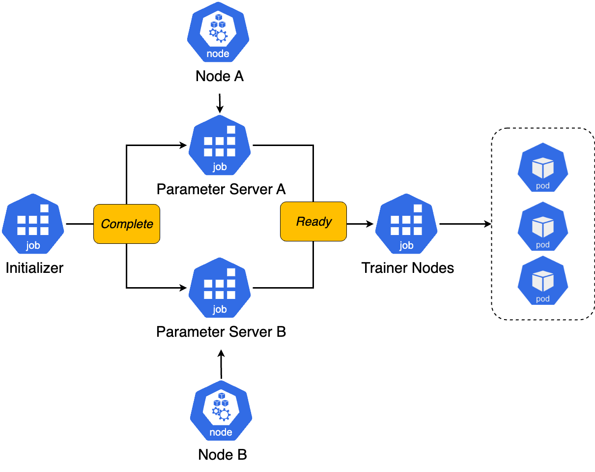

# KEP-672: Serial Job Execution with DependsOn API

<!--
This is the title of your KEP. Keep it short, simple, and descriptive. A good
title can help communicate what the KEP is and should be considered as part of
any review.
-->

<!--
A table of contents is helpful for quickly jumping to sections of a KEP and for
highlighting any additional information provided beyond the standard KEP
template.

Ensure the TOC is wrapped with
  <code>&lt;!-- toc --&rt;&lt;!-- /toc --&rt;</code>
tags, and then generate with `hack/update-toc.sh`.
-->

<!-- toc -->

- [Summary](#summary)
- [Motivation](#motivation)
  - [Goals](#goals)
  - [Non-Goals](#non-goals)
- [Proposal](#proposal)
  - [User Stories (Optional)](#user-stories-optional)
    - [Story 1](#story-1)
    - [Story 2](#story-2)
    - [Story 3](#story-3)
    - [Story 4](#story-4)
  - [Risks and Mitigations](#risks-and-mitigations)
- [Design Details](#design-details)
  - [API Details](#api-details)
  - [Implementation](#implementation)
  - [Quota Management](#quota-management)
  - [Deprecation of StartupPolicy](#deprecation-of-startuppolicy)
  - [Defaulting/Validation](#defaultingvalidation)
  - [Test Plan](#test-plan)
    - [Unit Tests](#unit-tests)
    - [Integration tests](#integration-tests)
  - [Graduation Criteria](#graduation-criteria)
- [Implementation History](#implementation-history)
- [Drawbacks](#drawbacks)
  - [Manage quota for Job sequence](#manage-quota-for-job-sequence)
  - [Support complex DAGs with JobSet](#support-complex-dags-with-jobset)
- [Alternatives](#alternatives)
  - [Using workflow engine to execute sequence of jobs](#using-workflow-engine-to-execute-sequence-of-jobs)
  - [Add the WaitForStatus API under ReplicatedJob](#add-the-waitforstatus-api-under-replicatedjob)
  <!-- /toc -->

## Summary

This KEP outlines the proposal to support serial Job execution within JobSet using the DependsOn
API. The JobSet should support to run sequence of ReplicatedJobs after they reach Ready or
Complete status.

## Motivation

Currently, JobSet supports the StartupPolicy API which allows to create Jobs in order after the
first Job is in ready status. This can be useful when driver should be ready before workers.
However, sometimes high performance computing and machine learning users want to run sequence of
ReplicatedJobs within JobSet. For example, it is common to run pre-processing,
distributed fine-tuning, post-processing for LLM fine-tuning.

### Goals

- Add support for serial Job execution using the DependsOn API.

### Non-Goals

- Support workflow management like DAGs outside of Job sequence.
  - Users should consider to use Argo Workflows or Tekton Pipelines for such use-cases.
- Allowing for a percentage of Jobs in a ReplicatedJob to be ready to consider the
  whole ReplicatedJob to ready.
- Support any other ReplicatedJob status other than Complete and Ready.
- Allow Job to depends on multiple previous ReplicatedJob. We will support this in the next
  iteration of this API.

## Proposal

### User Stories (Optional)

#### Story 1

As a user, I want to fine-tune LLM using multi-node training with JobSet. I have the first
ReplicatedJob for pre-trained model and dataset initialization, and the second ReplicatedJob for
distributed fine-tuning.

The example of JobSet looks as follows:

```yaml
apiVersion: jobset.x-k8s.io/v1alpha2
kind: JobSet
metadata:
  name: fine-tune-llm
spec:
  replicatedJobs:
    - name: initializer
      template:
        spec:
          template:
            spec:
              containers:
                - name: model-initializer
                  image: docker.io/kubeflow/model-initializer
                  volumeMounts:
                    - mountPath: /workspace/pre-trained-model
                      name: model-initializer
                - name: dataset-initializer
                  image: docker.io/kubeflow/dataset-initializer
                  volumeMounts:
                    - mountPath: /workspace/dataset
                      name: dataset-initializer
              volumes:
                - name: dataset-initializer
                  persistentVolumeClaim:
                    claimName: dataset-initializer
                - name: model-initializer
                  persistentVolumeClaim:
                    claimName: model-initializer
    - name: trainer-node
      dependsOn:
        - name: initializer
          status: Complete
      template:
        spec:
          parallelism: 3
          completions: 3
          template:
            spec:
              containers:
                - name: trainer
                  image: docker.io/kubeflow/trainer
                  resources:
                    limits:
                      nvidia.com/gpu: 5
                  volumeMounts:
                    - mountPath: /workspace/dataset
                      name: dataset-initializer
                    - mountPath: /workspace/pre-trained-model
                      name: model-initializer
              volumes:
                - name: dataset-initializer
                  persistentVolumeClaim:
                    claimName: dataset-initializer
                - name: model-initializer
                  persistentVolumeClaim:
                    claimName: model-initializer
```

#### Story 2

As a user, I want to fine-tune my LLM using MPI and DeepSpeed. I have the first
ReplicatedJob for pre-trained model and dataset initialization, the second ReplicatedJob for MPI launch
and the third ReplicatedJob for distributed fine-tuning.

The example of JobSet looks as follows:

```yaml
apiVersion: jobset.x-k8s.io/v1alpha2
kind: JobSet
metadata:
  name: deepspeed-mpi
spec:
  replicatedJobs:
    - name: initializer
      template:
        spec:
          template:
            spec:
              containers:
                - name: model-initializer
                  image: docker.io/kubeflow/model-initializer
                  volumeMounts:
                    - mountPath: /workspace/pre-trained-model
                      name: model-initializer
                - name: dataset-initializer
                  image: docker.io/kubeflow/dataset-initializer
                  volumeMounts:
                    - mountPath: /workspace/dataset
                      name: dataset-initializer
              volumes:
                - name: dataset-initializer
                  persistentVolumeClaim:
                    claimName: dataset-initializer
                - name: model-initializer
                  persistentVolumeClaim:
                    claimName: model-initializer
    - name: launcher
      dependsOn:
        - name: initializer
          status: Complete
      template:
        spec:
          parallelism: 1
          completions: 1
          template:
            spec:
              containers:
                - name: launcher
                  image: docker.io/kubeflow/mpi-launcher
                  resources:
                    limits:
                      nvidia.com/gpu: 5
                  volumeMounts:
                    - mountPath: /workspace/dataset
                      name: dataset-initializer
                    - mountPath: /workspace/pre-trained-model
                      name: model-initializer
              volumes:
                - name: dataset-initializer
                  persistentVolumeClaim:
                    claimName: dataset-initializer
                - name: model-initializer
                  persistentVolumeClaim:
                    claimName: model-initializer
    - name: trainer-node
      dependsOn:
        - name: launcher
          status: Ready
      template:
        spec:
          parallelism: 3
          completions: 3
          template:
            spec:
              containers:
                - name: trainer
                  image: docker.io/kubeflow/deepspeed-trainer
                  resources:
                    limits:
                      nvidia.com/gpu: 5
                  volumeMounts:
                    - mountPath: /workspace/dataset
                      name: dataset-initializer
                    - mountPath: /workspace/pre-trained-model
                      name: model-initializer
              volumes:
                - name: dataset-initializer
                  persistentVolumeClaim:
                    claimName: dataset-initializer
                - name: model-initializer
                  persistentVolumeClaim:
                    claimName: model-initializer
```

#### Story 3

As an HPC user, I want to run a set of simulations with MPI that complete successfully before
using the data for a next step analysis.

As an HPC user I want to scale up my simulation job only after a small set have completed
successfully. For that case, I could imagine essentially the same replicatedJob done twice,
just with a larger size. If the outcome of the first isn't success you wouldn't launch
the larger bulk of work.

#### Story 4

As a user, I want to fine-tune my LLM using TensorFlow using two Parameter Servers. I have the first
ReplicatedJob for pre-trained model and dataset initialization, the second and third ReplicatedJob
to start parameter servers and the fourth ReplicatedJob for distributed fine-tuning.

> [!NOTE]
> This use-case won't be supported in the initial implementation of the DependsOn API, since
> ReplicatedJob cannot depend on more than one other ReplicatedJob. However, we plan to consider
> adding support for this functionality in the future.



The example of JobSet looks as follows:

```yaml
apiVersion: jobset.x-k8s.io/v1alpha2
kind: JobSet
metadata:
  name: tensorflow-distributed
spec:
  replicatedJobs:
    - name: initializer
    - name: ps-a
      dependsOn:
        - name: initializer
          status: Completed
    - name: ps-b
      dependsOn:
        - name: initializer
          status: Completed
    - name: trainer-node
      dependsOn:
        - name: ps-a
          status: Ready
        - name: ps-b
          status: Ready
```

### Risks and Mitigations

This API will not allow to describe DAGs to avoid workflow manager features in JobSet.
The goal is to only focus on Job sequence to cover model training/HPC use-cases.

As described in the [quota management](#quota-management) section, currently Kueue will enqueue the
whole JobSet even when `DependsOn` is set. Thus, it will lock all ReplicatedJobs resources
(GPU, CPU, TPU) even if they are executed in the sequence. We can mitigate that risk
by enqueue each group of ReplicatedJobs separately with Kueue.

## Design Details

### API Details

```golang

type ReplicatedJob struct {
 // Name of the ReplicatedJob.
 Name string `json:"name"`

 // Wait for the previous ReplicatedJob status.
 DependsOn []DependsOn `json:"dependsOn,omitempty"`
}

type DependsOn struct {
 // Name of the previous ReplicatedJob that ReplicatedJob depends on.
 Name string `json:"name"`

 // Status of the previous Job. We only accept Ready or Complete status.
 Status DependsOnStatus `json:"status"`
}

type DependsOnStatus string

const (
 // Ready status means the Ready counter equals the number of child Jobs.
 // .spec.replicatedJobs["name==<JOB_NAME>"].replicas == .status.replicatedJobsStatus.name["name==<JOB_NAME>"].ready
 DependencyReady DependsOnStatus = "Ready"

 // Complete status means the Succeeded counter equals the number of child Jobs.
 // .spec.replicatedJobs["name==<JOB_NAME>"].replicas == .status.replicatedJobsStatus.name["name==<JOB_NAME>"].succeeded
 DependencyComplete DependsOnStatus = "Complete"
)
```

### Implementation

The JobSet operator will control the creation of ReplicatedJobs based on their DependsOn
configuration.

In the DependsOn API, user can only reference the **single** ReplicatedJob that previously
defined in the `.spec.replicatedJobs` list.

If ReplicatedJob has the DependsOn configuration, controller will check the counter of
Ready or Complete Jobs in the referenced ReplicatedJob. When the counter of Jobs is equal to
referenced ReplicatedJob's replica count, the controller will create the ReplicatedJob.

If JobSet is suspended the all ReplicatedJobs will be suspended and the Job sequence starts again.

When the JobSet is restarted after failure, the Job sequence starts again. User controls how many
times Job can be restarted via backOffLimit parameter.

### Quota Management

In the initial implementation of the DependsOn API the resource quota will be calculated as
sum of all ReplicatedJobs resources. Which means JobSet will be admitted by
[Kueue](https://github.com/kubernetes-sigs/kueue) only when all resources are available for
every ReplicatedJob within JobSet.

That allows us to leverage the existing integration between Kueue and JobSet while using the
DependsOn API.

In the future versions we will discuss how Kueue can enqueue group of ReplicatedJobs separately
and admit them. For example, when compute resources are available for the first ReplicatedJob
the JobSet can be dispatched by Kueue.

### Deprecation of StartupPolicy

Since the new DependsOn API covers use-cases for the `startupPolicy: InOrder`, we will deprecate the
StartupPolicy API in the future version of JobSet. Before deprecation, we will make
StartupPolicy and DependsOn API mutually exclusive. Which means, user can use only
StartupPolicy or DependsOn API.

User should configure JobSet as follows to use the existing functionality of StartupPolicy:

```yaml
apiVersion: jobset.x-k8s.io/v1alpha2
kind: JobSet
metadata:
  name: mpi-job
spec:
  replicatedJobs:
    - name: launcher
    - name: trainer-node
      dependsOn:
        - name: launcher
          status: Ready
```

### Defaulting/Validation

- DependsOn API is immutable.
- Length of DependsOn list is equal to 1.
- Ensure that `replicatedJobs[n].dependsOn[0].name` is equal to the the previously defined
  ReplicatedJob's name (e.g. `n-1` from the list).
- If DependsOn is set, `name` and `status` must be configured.
- The first ReplicatedJob (e.g `n=0` in the list) can't contain DependsOn API.
- Make DependsOn and StartupPolicy mutually exclusive.

### Test Plan

[x] I/we understand the owners of the involved components may require updates to
existing tests to make this code solid enough prior to committing the changes necessary
to implement this enhancement.

#### Unit Tests

- `controllers`: `01/19/2024` - `30.2%`

We will add this functionality to the startup_policy API for the functionality.

#### Integration tests

- Using "ready" ReplicatedJobs status for JobSet with 2+ ReplicatedJobs
- Using "complete" ReplicatedJobs status for JobSet with 2+ ReplicatedJobs
- Validate that if the first ReplicatedJob fails, the second ReplicatedJob does not execute.
- Ensure that when DependsOn and FailurePolicy sets together, the JobSet will restart
  the job sequence from the beginning in case of failure.
- Validate the JobSet controller restart in the middle of the ReplicatedJobs execution when
  DependsOn is set.

### Graduation Criteria

<!--

Clearly define what it means for the feature to be implemented and
considered stable.

If the feature you are introducing has high complexity, consider adding graduation
milestones with these graduation criteria:
- [Maturity levels (`alpha`, `beta`, `stable`)][maturity-levels]
- [Feature gate][feature gate] lifecycle
- [Deprecation policy][deprecation-policy]

[feature gate]: https://git.k8s.io/community/contributors/devel/sig-architecture/feature-gates.md
[maturity-levels]: https://git.k8s.io/community/contributors/devel/sig-architecture/api_changes.md#alpha-beta-and-stable-versions
[deprecation-policy]: https://kubernetes.io/docs/reference/using-api/deprecation-policy/
-->

## Implementation History

- Draft KEP: September 25th 2024

## Drawbacks

### Manage quota for Job sequence

It is hard to manage quota for sequence of Job within single JobSet. Usually, users don't want to
lock resources (e.g. GPUs/TPUs) when the first Job is running.

### Support complex DAGs with JobSet

If users want to create complex DAG workflows, they should not use JobSet for such purpose.

## Alternatives

### Using workflow engine to execute sequence of jobs

Instead of supported DependsOn API, users can leverage the existing workflow
engines like Argo Workflow or Tekton Pipeline to execute it.

While workflow engines are a good option for orchestrating Directed Acyclic Graphs (DAGs),
users may want to include the initialization phase as part of their training jobs. This is
particularly important in LLMs fine-tuning use cases, where every training job involves downloading
and distributing pre-trained models and datasets across all training nodes before starting
distributed fine-tuning.

For such use-cases users can consider the pre-trained model and dataset download, along with
distributed fine-tuning as integral parts of the ML training step within the broader
AI/ML lifecycle, which contains data preparation, training, tuning, evaluation, and serving stages.

Thus, providing users the option to initialize ML assets as part of a single JobSet make sense.
However, for complex data preparation tasks, such as those using engines like Spark, users should
consider to decouple them from the JobSet used for training/fine-tuning.

### Add the WaitForStatus API under ReplicatedJob

We can add the WaitForReplicatedJobsStatus option under the ReplicatedJob API:

```golang
type ReplicatedJob struct {
  // Name is the name of the entry and will be used as a suffix.
  Name string `json:"name"`

  // Status the target ReplicatedJobs must reach before subsequent ReplicatedJobs begin executing.
  WaitForStatusBeforeContinuing WaitForStatusBeforeContinuing `json:"WaitForStatusBeforeContinuing,omitempty"`
}
```

However this API is simpler, we can’t support more advanced use-cases when two ReplicatedJobs
need to start in parallel. For example, two parameter servers need to be Ready before we
start the Trainer.

Additional alternatives are discussed in
[this document](https://docs.google.com/document/d/1_xZ4UJ6FwJ8sG3i7XnBi1kG4mglNzxji94fweNH4YnE/edit?tab=t.0).
