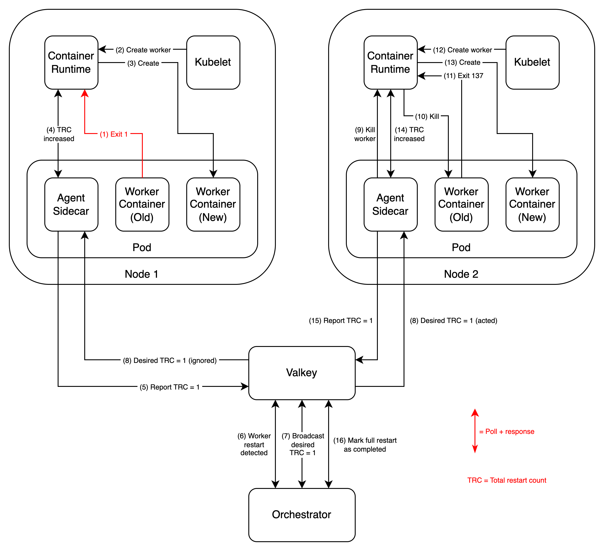

# KEP-876: Short term solution for in place restarts

<!--
This is the title of your KEP. Keep it short, simple, and descriptive. A good
title can help communicate what the KEP is and should be considered as part of
any review.
-->

<!--
A table of contents is helpful for quickly jumping to sections of a KEP and for
highlighting any additional information provided beyond the standard KEP
template.

Ensure the TOC is wrapped with
  <code>&lt;!-- toc --&rt;&lt;!-- /toc --&rt;</code>
tags, and then generate with `hack/update-toc.sh`.
-->

<!-- toc -->
- [Summary](#summary)
- [Motivation](#motivation)
  - [Goals](#goals)
  - [Non-Goals](#non-goals)
- [Proposal](#proposal)
  - [User Stories](#user-stories)
    - [Story 1](#story-1)
  - [Notes/Constraints/Caveats](#notesconstraintscaveats)
- [Design Details](#design-details)
  - [Custom JobSet installation](#custom-jobset-installation)
  - [API Changes](#api-changes)
  - [JobSet Sample](#jobset-sample)
  - [Prototype and Benchmark](#prototype-and-benchmark)
  - [Long Term Solution](#long-term-solution)
  - [Test Plan](#test-plan)
    - [Unit Tests](#unit-tests)
    - [Integration tests](#integration-tests)
  - [Graduation Criteria](#graduation-criteria)
- [Implementation History](#implementation-history)
- [Drawbacks](#drawbacks)
- [Alternatives](#alternatives)
<!-- /toc -->

## Summary

<!--
This section is incredibly important for producing high-quality, user-focused
documentation such as release notes or a development roadmap. It should be
possible to collect this information before implementation begins, in order to
avoid requiring implementors to split their attention between writing release
notes and implementing the feature itself. KEP editors and SIG Docs
should help to ensure that the tone and content of the `Summary` section is
useful for a wide audience.

A good summary is probably at least a paragraph in length.

Both in this section and below, follow the guidelines of the [documentation
style guide]. In particular, wrap lines to a reasonable length, to make it
easier for reviewers to cite specific portions, and to minimize diff churn on
updates.

[documentation style guide]: https://github.com/kubernetes/community/blob/master/contributors/guide/style-guide.md
-->

Typically in ML distributed training jobs, when a worker fails, all workers must be restarted. This is currently achieved in JobSet by recreating all Pods, which can take minutes to complete. At scales such as 10k nodes, there are many worker failures per day, so that each minute of restart overhead costs ~ 1 million per month in infra costs and ~ 10 hours of training downtime per month. One solution for improving recovery time is restarting all Pods in place (by restarting the worker containers) instead of deleting, creating and scheduling all Pods. This KEP proposes a short term implementation for the in place restart feature and paves the way for a long term solution. Benchmarks on a cluster of 5k nodes show an improvement from 2m13s in the baseline to 5s using the feature. Finally, we acknowledge that the short term solution contains shortcomings and we address them by making the feature opt-in and conducting a parallel long term solution which will require upstream changes.

## Motivation

<!--
This section is for explicitly listing the motivation, goals, and non-goals of
this KEP.  Describe why the change is important and the benefits to users. The
motivation section can optionally provide links to [experience reports] to
demonstrate the interest in a KEP within the wider Kubernetes community.

[experience reports]: https://github.com/golang/go/wiki/ExperienceReports
-->

When a worker fails in a ML distributed training job, the underlying framework typically requires all workers to restore the latest checkpoint and resume training from that point. This means that all workers on all hosts must be restarted. When such a large scale training workload runs as a Kubernetes Job and a worker fails, restarting all worker processes at scale becomes challenging since it translates to deleting, recreating and rescheduling all worker Pods. This is further impacted by the fact that large distributed training workloads typically have special scheduling constraints (e.g., TPU multislice training) which increases the recovery time.

Ideally, instead of deleting and rescheduling thousands of Pods, we can achieve better [goodput](https://cloud.google.com/blog/products/ai-machine-learning/goodput-metric-as-measure-of-ml-productivity) by restarting all Pods in place on the same nodes. That is, simply restarting the container processes running the ML training job. Keeping workers in place also improves performance by preserving worker resources that are local to the nodes they run on. Unfortunately, Kubernetes has no mechanism to achieve in place restarts today since Pods are ephemeral units by design and failures are handled by deleting and recreating Pods themselves.

### Goals

<!--
List the specific goals of the KEP. What is it trying to achieve? How will we
know that this has succeeded?
-->

* Provide an opt in feature for users with large workloads to significantly speed up their restart time  
* Propose a short term implementation for the feature and pave the way for a long term solution

### Non-Goals

<!--
What is out of scope for this KEP? Listing non-goals helps to focus discussion
and make progress.
-->

* Improve restart time for all workloads that can be created with JobSet at all scales. We want to provide performance gains for use cases that justify the increased deployment complexity  
* Provide a definitive and fully native implementation for improving restart time in JobSet. We understand that performant solutions that are fully native require upstream changes to Kubernetes

## Proposal

<!--
This is where we get down to the specifics of what the proposal actually is.
This should have enough detail that reviewers can understand exactly what
you're proposing, but should not include things like API designs or
implementation. What is the desired outcome and how do we measure success?.
The "Design Details" section below is for the real
nitty-gritty.
-->

### User Stories

<!--
Detail the things that people will be able to do if this KEP is implemented.
Include as much detail as possible so that people can understand the "how" of
the system. The goal here is to make this feel real for users without getting
bogged down.
-->

#### Story 1

As a user, I am running a distributed ML training workload using JobSet. When any worker fails, I want all of the workers to restart together. Currently, JobSet achieves that by recreating all Jobs, which recreates all Pods. This process works but takes minutes to complete. At my scale (e.g., 10k nodes), there are many worker failures per day, so that each minute of restart overhead costs ~ 1 million per month in infra costs and ~ 10 hours of training downtime per month. Furthermore, this problem is expected to get worse at larger scales, which affects long term plans for running larger workloads. Therefore, I want to reduce my restart time overhead as much as possible to reduce costs and speed up training.

### Notes/Constraints/Caveats

<!--
What are the caveats to the proposal?
What are some important details that didn't come across above?
Go in to as much detail as necessary here.
This might be a good place to talk about core concepts and how they relate.
-->

For context, here is a simplified yaml of how users currently run ML training workloads in JobSet. It assumes a cluster with 5000 nodes divided into 5 node pools is available. Only one worker is run per node.

```yaml
apiVersion: jobset.x-k8s.io/v1alpha2
kind: JobSet
metadata:
  name: workload-example
  annotations:
    alpha.jobset.sigs.k8s.io/exclusive-topology: cloud.google.com/gke-nodepool # 1:1 Job replica to GKE node pool assignment. Final effect is having one worker per node
spec:
  failurePolicy:
    maxRestarts: 20 # Maximum number of restarts
  replicatedJobs:
  - name: workers
    replicas: 5 # Number of node pools
    template:
      spec:
        completions: 1000 # Number of VMs per node pool
        parallelism: 1000 # Number of VMs per node pool
        backoffLimit: 0 # Must be 0 to fail Job replica if any worker fails, which will make JobSet controller recreate all Pods
        template:
          spec:
            containers:
            - name: worker
              image: worker-image
```

## Design Details

<!--
This section should contain enough information that the specifics of your
change are understandable. This may include API specs (though not always
required) or even code snippets. If there's any ambiguity about HOW your
proposal will be implemented, this is the place to discuss them.
-->

We propose to add / change the following components in JobSet:

* (New) One agent per worker Pod, which will handle the respective worker container and coordinate workload wide. It runs as a sidecar in each worker Pod and is defined in the JobSet manifest by the user using an image built from code available in the JobSet repository  
* (New) One orchestrator per JobSet controller Pod, which will handle workloads cluster wide. It runs as a sidecar in each JobSet controller Pod and is installed with the JobSet controller by setting a flag in the Helm chart  
* (New) One Valkey database, which will handle workloads cluster wide. It is exposed through a service and is installed with the JobSet controller by setting a flag in the Helm chart. Valkey is the most popular fork of Redis and has a license compatible with Kubernetes  
* (Change) Change the JobSet controller to fail the JobSet if the value of the annotation `alpha.jobset.sigs.k8s.io/inplace-restarts` in the JobSet object exceeds `jobSet.spec.failurePolicy.maxRestarts`

On a high level, the design works as follows

* Total restart count  
  * In a workload, each worker will have a value associated with it called total restart count (TRC) that is tracked by its agent and preserved on Valkey  
  * When all total restart count values are equal, the workers are inferred to be in sync  
  * Otherwise, the workers are inferred to not be in sync and something must be done  
* Starting points  
  * When the JobSet object is created, all worker Pods are created. Their total restart count values are set to `0`  
  * When the JobSet object is restarted (full recreation), all worker Pods are recreated. Their total restart count values are set to `0` as well  
  * In both cases all restart count values are equal, so the workers are inferred to be in sync  
* Lose sync  
  * If a worker container exits non-zero, it is restarted by container runtime. Its total restart count is increased by `1`  
  * If something like a node failure happens, the worker Pod is recreated independently. Its total restart count is increased by `1` as well  
  * Both cases cause the total restart count values of all workers to not be the same value, so the workers are inferred to be not in sync  
* Restore sync  
  * If the total restart count of all workers differ by only `1`, then the workload is recoverable by performing an in place restart (full restart)  
  * Otherwise, or if any other error occurs, then the workload is not recoverable by performing an in place restart (full restart) and the orchestrator must fail over to restarting the JobSet object (full recreation)  
* In place restart (full restart)  
  * When the total restart count of a worker changes, its agent is responsible for reporting the change to Valkey  
  * The orchestrator is responsible for detecting these changes and broadcasting a message to all agents informing them of the new desired total restart count  
  * The agents are responsible for receiving the broadcast message and making sure their total restart count matches the desired value  
    * If the values are the same, do nothing  
    * If the values differ by `1`, restart its worker  
    * If the values differ by more than `1`, report this to Valkey, which will make the orchestrator fail over to a full recreation  
* Fail over with JobSet object restart (full recreation)  
  * If anything not recoverable with an in place restart happens, the orchestrator will restart the JobSet object by deleting the child jobs, which will start a full recreation  
* Fail the JobSet  
  * If the total number of full restarts and full recreations (saved as the `alpha.jobset.sigs.k8s.io/inplace-restarts` annotation in the JobSet object by the orchestrator) exceeds `jobSet.spec.failurePolicy.maxRestarts`, then the JobSet controller will fail the JobSet object

The following diagram shows an example of a workload with 2 workers. It shows how the proposed design detects a worker container failure, performs an in place restart to restore sync and detects the operation is complete.



### Custom JobSet installation

To support JobSet objects that use in place restart, the orchestrator must run as a sidecar in the JobSet controller Pods and a Valkey service must be deployed. We propose to install both with a Helm chart behind an opt in flag.

### API changes

There is no change to the JobSet spec. Instead, we will reserve 2 new annotations for JobSet objects

* `alpha.jobset.sigs.k8s.io/inplace-timeout`: This annotation is set by the user in the JobSet manifest and serves two purposes. First, if the annotation is set, the orchestrator will detect that it should handle this JobSet object. Second, if the in place restart duration takes more than the annotation value (a possible edge case), then the orchestrator will time out the in place restart and fail over to full recreation  
* `alpha.jobset.sigs.k8s.io/inplace-restarts`: This annotation is set by the orchestrator and starts at `0`. Every time there is a full restart or a full recreation, the orchestrator increases this annotation value by `1`. If the annotation value exceeds `jobSet.spec.failurePolicy.maxRestarts`, the JobSet controller will fail the JobSet object

### JobSet Sample

The user also has to configure the sidecar agent in the JobSet manifest as shown next

```yaml
apiVersion: jobset.x-k8s.io/v1alpha2
kind: JobSet
metadata:
  name: in-place-restart-example
  annotations:
    alpha.jobset.sigs.k8s.io/exclusive-topology: cloud.google.com/gke-nodepool # 1:1 Job replica to GKE node pool assignment. Final effect is having one worker per node
    alpha.jobset.sigs.k8s.io/inplace-timeout: "60s" # Activate in place restart feature. In place timeout before failing over to recreating all Pods
    # alpha.jobset.sigs.k8s.io/inplace-restarts: 0  # This is added by the orchestrator and is compared to maxRestarts by the JobSet controller
spec:
  failurePolicy:
    maxRestarts: 20 # Maximum number of restarts
  replicatedJobs:
  - name: workers
    replicas: 5 # Number of node pools
    template:
      spec:
        completions: 1000 # Number of VMs per node pool
        parallelism: 1000 # Number of VMs per node pool
        backoffLimit: 2147483647 # MaxInt32. Required to not fail the Job due to intential container restarts, which count towards backoffLimit
        template:
          spec:
            restartPolicy: OnFailure # Do not fail the Pod if the worker fails or is killed
            volumes:
            - name: cri-socket # Required to mount CRI socket
              hostPath:
                path: /run/containerd/containerd.sock
                type: Socket
            - name: startup-volume # Required to handle independent Pod failure and agent failure
              emptyDir: {}
            containers:
            # User worker container
            - name: worker
              image: worker-image
            initContainers:
            # Agent sidecar
            - name: agent
              restartPolicy: Always # Sidecar
              securityContext: # Required to mount CRI socket
                privileged: true
              image: agent-image # Buildable from code in JobSet repo
              args: # Can be defaulted to env vars to simplify manifest
              - "--worker-jobset-uid=$(JOBSET_UID)"
              - "--worker-id=$(JOBSET_NAME)-$(REPLICATED_JOB_NAME)-$(JOB_INDEX)-$(JOB_COMPLETION_INDEX)"
              - "--worker-pod-uid=$(POD_UID)"
              - "--worker-container-name=worker"
              - "--worker-termination-grace-period=10s"
              - "--cri-socket-path=unix:///run/containerd/containerd.sock"
              - "--cri-polling-interval=1s"
              - "--valkey-address=valkey.default.svc.cluster.local:6379"
              env:
              - name: JOBSET_UID
                valueFrom:
                  fieldRef:
                    fieldPath: metadata.annotations['jobset.sigs.k8s.io/jobset-uid']
              - name: JOBSET_NAME
                valueFrom:
                  fieldRef:
                    fieldPath: metadata.annotations['jobset.sigs.k8s.io/jobset-name']
              - name: REPLICATED_JOB_NAME
                valueFrom:
                  fieldRef:
                    fieldPath: metadata.annotations['jobset.sigs.k8s.io/replicatedjob-name']
              - name: JOB_INDEX
                valueFrom:
                  fieldRef:
                    fieldPath: metadata.annotations['jobset.sigs.k8s.io/job-index']
              - name: JOB_COMPLETION_INDEX
                valueFrom:
                  fieldRef:
                    fieldPath: metadata.annotations['batch.kubernetes.io/job-completion-index']
              - name: POD_UID
                valueFrom:
                  fieldRef:
                    fieldPath: metadata.uid
              volumeMounts:
              - name: cri-socket # Mount CRI socket
                mountPath: /run/containerd/containerd.sock
              - name: startup-volume # Required to handle independent Pod failure and agent failure
                mountPath: /app/startup
              startupProbe: # Required to make sure worker will start only after agent is ready
                httpGet:
                  path: /ready
                  port: 80
```

### Prototype and Benchmark

See the prototype code [here](https://github.com/GiuseppeTT/jobset/compare/main...GiuseppeTT:jobset:in-place-pod-restart-prototype-v2) and the benchmark [here](https://docs.google.com/document/d/1Mer8Mt0Sq1NXBF1UyvJ8ebF_0lG88h16xJsREnvvUMo/edit?tab=t.qh3jlkiohc8x). For a cluster with 5k nodes, recovering from a worker failure (worker exits non-zero) resulted in a restart duration of ~ 5s with in place restart, compared to ~ 2m13s with the baseline. When the failure source was a Pod (deleted Pod), these times changed to 13s and 2m8s respectively.

### Long Term Solution

The long term solution is still in the early stages. [This document](https://docs.google.com/document/d/1bfcMOL-DJG8M9YtFxLSVFyknfJUd7yh8RpwLSRLX50c/edit?usp=sharing) presented in the SIG Node meeting summarizes the proposed changes.

### Test Plan

<!--
**Note:** *Not required until targeted at a release.*
The goal is to ensure that we don't accept enhancements with inadequate testing.

All code is expected to have adequate tests (eventually with coverage
expectations). Please adhere to the [Kubernetes testing guidelines][testing-guidelines]
when drafting this test plan.

[testing-guidelines]: https://git.k8s.io/community/contributors/devel/sig-testing/testing.md
-->

[X] I/we understand the owners of the involved components may require updates to
existing tests to make this code solid enough prior to committing the changes necessary
to implement this enhancement.

#### Unit Tests

<!--
In principle every added code should have complete unit test coverage, so providing
the exact set of tests will not bring additional value.
However, if complete unit test coverage is not possible, explain the reason of it
together with explanation why this is acceptable.
-->

<!--
Additionally, try to enumerate the core package you will be touching
to implement this enhancement and provide the current unit coverage for those
in the form of:
- <package>: <date> - <current test coverage>

This can inform certain test coverage improvements that we want to do before
extending the production code to implement this enhancement.
-->

- `<package>`: `<date>` - `<test coverage>`

#### Integration tests

<!--
Describe what tests will be added to ensure proper quality of the enhancement.

After the implementation PR is merged, add the names of the tests here.
-->

Integration tests will be added to ensure that a JobSet object can be restarted when in place restart is used.

### Graduation Criteria

<!--

Clearly define what it means for the feature to be implemented and
considered stable.

If the feature you are introducing has high complexity, consider adding graduation
milestones with these graduation criteria:
- [Maturity levels (`alpha`, `beta`, `stable`)][maturity-levels]
- [Feature gate][feature gate] lifecycle
- [Deprecation policy][deprecation-policy]

[feature gate]: https://git.k8s.io/community/contributors/devel/sig-architecture/feature-gates.md
[maturity-levels]: https://git.k8s.io/community/contributors/devel/sig-architecture/api_changes.md#alpha-beta-and-stable-versions
[deprecation-policy]: https://kubernetes.io/docs/reference/using-api/deprecation-policy/
-->

* Alpha: The feature as described in this KEP is implemented and tested  
* Beta: The feature incorporates the necessary upstream changes to make it fully native  
* Stable: The feature demonstrates widespread production reliability for 2 release cycles

## Implementation History

<!--
Major milestones in the lifecycle of a KEP should be tracked in this section.
Major milestones might include:
- the `Summary` and `Motivation` sections being merged, signaling SIG acceptance
- the `Proposal` section being merged, signaling agreement on a proposed design
- the date implementation started
- the first Kubernetes release where an initial version of the KEP was available
- the version of Kubernetes where the KEP graduated to general availability
- when the KEP was retired or superseded
-->

* [First request](https://github.com/kubernetes-sigs/jobset/issues/467): March 22th, 2024  
* [Design proposal](https://github.com/kubernetes-sigs/jobset/issues/876): April 11th, 2025  
* KEP: May 23rd, 2025

## Drawbacks

<!--
Why should this KEP _not_ be implemented?
-->

This KEP proposes the short term implementation for in place restart, which contains hacks like mounting the CRI socket to monitor and restart worker containers instead of using the api server or kubelet. This is why we are proposing this feature as opt in and taking other measures such as running the orchestrator as a sidecar instead of integrating it directly to JobSet controller code. 

## Alternatives

<!--
What other approaches did you consider, and why did you rule them out? These do
not need to be as detailed as the proposal, but should include enough
information to express the idea and why it was not acceptable.
-->

Initial investigations showed that fully native solutions do not scale. For instance, we benchmarked a native solution (see code [here](https://github.com/danielvegamyhre/jobset/tree/script/hack/restart_handler/exec)) that works as following

1. Each worker runs as a child process of a process called handler in the worker container  
2. When a worker fails, its handler detects the failure and acquires a lease on a shared ConfigMap  
3. When the lease is acquired, the same handler sends an exec to each worker Pod to execute a special command to each handler  
4. When a handler receives this special command, it recreates its worker child process

This unconventional solution was designed to work around the limitations of the Job API for handling intentional container restarts and to reduce pressure to the api server and etcd as much as possible.

In a test with 5k nodes and 5k Pods (one worker Pod per node), this native solution took 109s compared to 152s of the baseline (recreate all Pods), whereas a similar solution to the one proposed in this KEP took 1s. While the 43s improvement is welcome, we believe the solution proposed in this KEP (along with future upstream changes to make it fully native) present a better opportunity to improve restart time in JobSet.